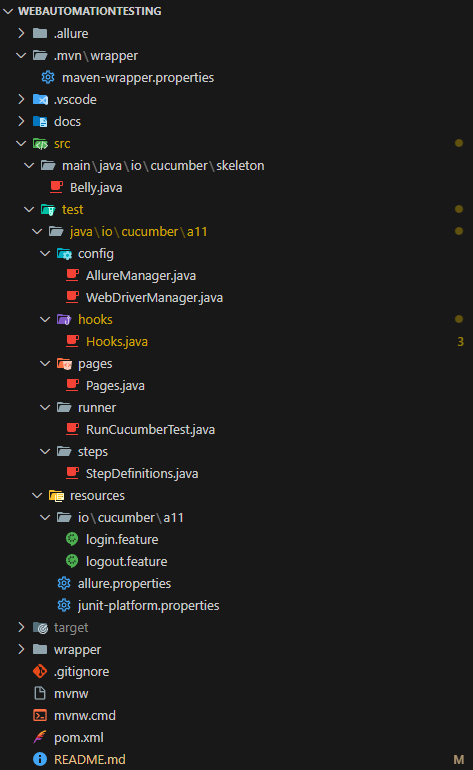
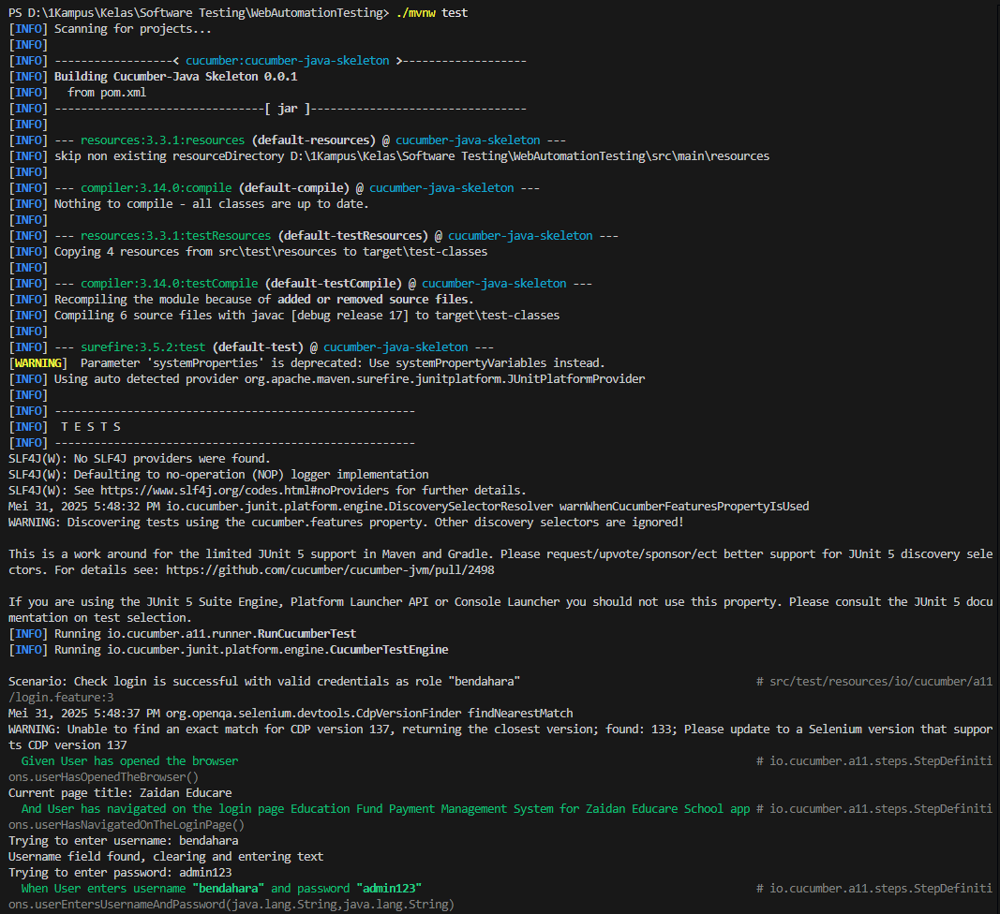
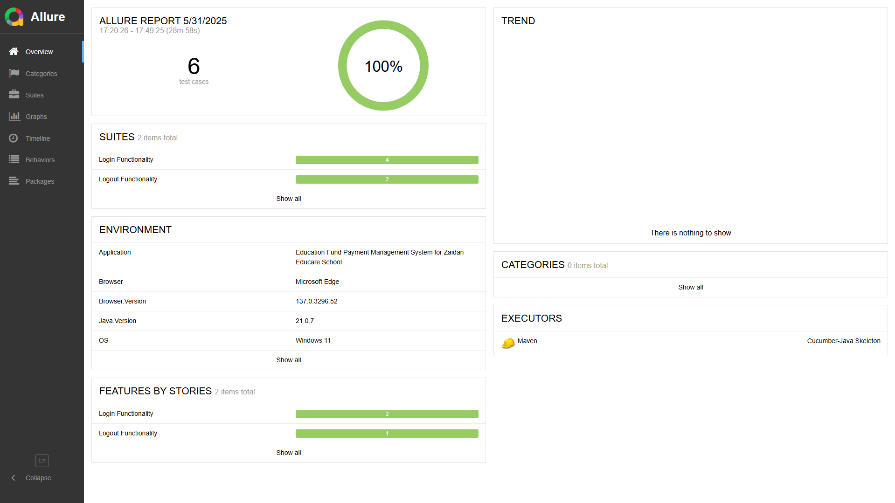

# Web Automation Testing dengan Cucumber dan Selenium

## Team Members
**Kelompok A11**
- Muhamad Fahrizal Al-Zaelani
- Muhammad Fikri Nur Sya'Bani
- Saabiq Muhyiyuddin Aulawi

## Requirement
- Java Development Kit (JDK) 17 ++
- Maven (opsional, karena sudah disediakan Maven Wrapper)
- Internet untuk mengunduh dependensi Maven dan WebDriver

## Pengaturan Environment
1. **Konfigurasi Java Development Kit (JDK)**
   - Install JDK 17 atau versi lebih tinggi
   - Set JAVA_HOME environment variable
   - Tambahkan Java ke PATH system

2. **Konfigurasi Maven**
   - Maven wrapper sudah disediakan dalam project (mvnw)
   - Jika ingin install Maven: download dari apache.maven.org
   - Tambahkan Maven ke PATH system

3. **Konfigurasi Browser**
   - Project menggunakan Microsoft Edge WebDriver
   - WebDriver akan diunduh otomatis oleh WebDriverManager

## Alur Proses Testing
1. **Inisialisasi Project**
   - Clone repository
   - Install dependencies melalui Maven
   - Verifikasi konfigurasi environment

2. **Eksekusi Test**
   ```mermaid
   graph TD
   A[Start] --> B[Initialize WebDriver]
   B --> C[Load Test Features]
   C --> D[Execute Test Steps]
   D --> E[Capture Screenshots]
   E --> F[Generate Reports]
   F --> G[End]
   ```

## Pemetaan Langkah Pengujian

### 1. Konsep Page Object Model (POM)
- **Pages Package** (`src/test/java/io/cucumber/zaidan/pages/`)
  - Berisi class untuk setiap halaman web
  - Menyimpan element locators
  - Implementasi aksi pada halaman

### 2. Step Definitions
- **Steps Package** (`src/test/java/io/cucumber/zaidan/steps/`)
  - Mengimplementasikan langkah-langkah Gherkin
  - Menghubungkan feature files dengan kode test
  - Menggunakan Page Objects untuk interaksi

### 3. Feature Files
- **Resources** (`src/test/resources/io/cucumber/zaidan/`)
  - Berisi skenario test dalam format Gherkin
  - Mendeskripsikan behavior aplikasi
  - Ditulis dalam format yang mudah dibaca

## Test Reporting

### 1. Cucumber Reports
- Tersedia di `target/cucumber-reports/report.html`
- Menampilkan hasil test per-feature dan per-scenario
- Includs steps execution status dan duration

### 2. Allure Reports
- **Fitur yang ditampilkan:**
  - Dashboard overview
  - Test execution timeline
  - Screenshots untuk setiap langkah
  - Detailed test steps
  - Environment information

## Screenshots Dokumentasi

### 1. Pengembangan Project

*Project structure dalam Visual Studio Code*

### 2. Eksekusi Test

*Proses eksekusi test via Maven*

### 3. Hasil Report

*Dashboard Allure Report*

## Cara Menjalankan Pengujian

1. **Clone repo** (jika menggunakan Git):
   ```powershell
   git clone [URL_REPOSITORY]
   cd WebAutomation
   ```

2. **Jalankan testing** menggunakan Maven Wrapper:
   ```powershell
   ./mvnw clean test
   ```
   Atau jika menggunakan Maven yang sudah terinstal:
   ```powershell
   mvn clean test
   ```

3. **Create laporan Allure**:
   ```powershell
   ./mvnw allure:report
   ```
   Atau:
   ```powershell
   mvn allure:report
   ```

4. **Melihat laporan Allure**:
   ```powershell
   ./mvnw allure:serve
   ```
   Atau:
   ```powershell
   mvn allure:serve
   ```
   Perintah ini akan membuka browser secara otomatis dengan laporan Allure.

## Men-Deploy Laporan Allure ke GitHub Pages

### 1. Persiapan Laporan untuk GitHub Pages
1. Jalankan test dan hasilkan laporan Allure:
   ```powershell
   mvn clean test allure:report
   ```

2. Gunakan script yang disediakan untuk menyiapkan laporan untuk GitHub Pages:
   ```powershell
   .\prepare-allure-for-github-pages.ps1
   ```
   Script ini akan menyalin laporan ke dalam direktori `docs/` dan membuat file `.nojekyll`.

### 2. Men-Deploy ke GitHub
1. Commit dan push perubahan ke repositori GitHub Anda:
   ```powershell
   git add docs/ .nojekyll
   git commit -m "Add Allure report for GitHub Pages"
   git push origin main
   ```

2. Buka repositori GitHub Anda di browser.
3. Pergi ke **Settings** > **Pages**.
4. Di bagian **Source**, pilih **Deploy from a branch**.
5. Pilih branch **main** dan direktori **/docs** kemudian klik **Save**.
6. Tunggu beberapa menit hingga GitHub Pages di-deploy.

### 3. Akses Laporan Online
Setelah deployment selesai, laporan Allure akan tersedia di URL:
```
https://[username].github.io/[repository-name]/
```
